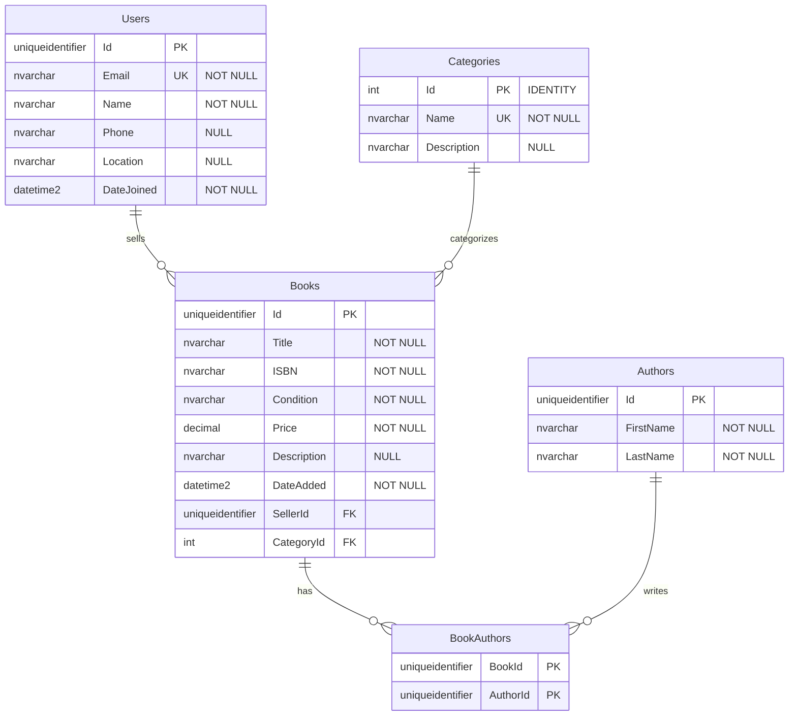

# Book Exchange Portal - Database Schema Documentation

## Overview

The Book Exchange Portal uses a relational database design with four core entities that support a peer-to-peer textbook marketplace. The schema is designed for data integrity, performance, and scalability.

**Database Type:** Azure SQL Database  
**ORM:** Entity Framework Core 8  
**Hosting:** Azure SQL Database (Basic Tier)

## Entity Relationship Diagram



## Core Entities

### 1. Users Table

**Purpose:** Store seller and buyer profile information

| Column Name | Data Type | Constraints | Description |
|-------------|-----------|-------------|-------------|
| Id | uniqueidentifier | PRIMARY KEY, NOT NULL | Unique user identifier (GUID) |
| Name | nvarchar(100) | NOT NULL | User's full name |
| Email | nvarchar(255) | NOT NULL, UNIQUE | User's email address |
| Phone | nvarchar(20) | NULL | Contact phone number |
| Location | nvarchar(100) | NULL | Campus location or dorm |
| DateJoined | datetime2 | NOT NULL, DEFAULT(GETDATE()) | Registration timestamp |

**Indexes:**
- PRIMARY KEY on `Id`
- UNIQUE INDEX on `Email`

### 2. Categories Table

**Purpose:** Classify books by academic subject/department

| Column Name | Data Type | Constraints | Description |
|-------------|-----------|-------------|-------------|
| Id | int | IDENTITY(1,1), PRIMARY KEY | Auto-increment category ID |
| Name | nvarchar(50) | NOT NULL, UNIQUE | Category name (e.g., "Computer Science") |
| Description | nvarchar(255) | NULL | Optional category description |

**Indexes:**
- PRIMARY KEY on `Id`
- UNIQUE INDEX on `Name`

### 3. Books Table

**Purpose:** Store book listings with pricing and condition information

| Column Name | Data Type | Constraints | Description |
|-------------|-----------|-------------|-------------|
| Id | uniqueidentifier | PRIMARY KEY, NOT NULL | Unique book listing identifier (GUID) |
| Title | nvarchar(200) | NOT NULL | Book title |
| ISBN | nvarchar(20) | NOT NULL | International Standard Book Number |
| Condition | nvarchar(20) | NOT NULL | Book condition (New, Like New, etc.) |
| Price | decimal(10,2) | NOT NULL | Selling price in USD |
| Description | nvarchar(1000) | NULL | Additional details about the book |
| DateAdded | datetime2 | NOT NULL, DEFAULT(GETDATE()) | Listing creation timestamp |
| SellerId | uniqueidentifier | FOREIGN KEY, NOT NULL | Reference to Users.Id |
| CategoryId | int | FOREIGN KEY, NOT NULL | Reference to Categories.Id |

**Indexes:**
- PRIMARY KEY on `Id`
- FOREIGN KEY INDEX on `SellerId` → `Users.Id`
- FOREIGN KEY INDEX on `CategoryId` → `Categories.Id`
- INDEX on `ISBN` for search performance
- INDEX on `Title` for search performance

### 4. Authors Table

**Purpose:** Store author information with many-to-many relationship to books

| Column Name | Data Type | Constraints | Description |
|-------------|-----------|-------------|-------------|
| Id | uniqueidentifier | PRIMARY KEY, NOT NULL | Unique author identifier (GUID) |
| FirstName | nvarchar(50) | NOT NULL | Author's first name |
| LastName | nvarchar(50) | NOT NULL | Author's last name |

**Indexes:**
- PRIMARY KEY on `Id`
- INDEX on `LastName, FirstName` for search performance

### 5. BookAuthors Table (Junction Table)

**Purpose:** Many-to-many relationship between Books and Authors

| Column Name | Data Type | Constraints | Description |
|-------------|-----------|-------------|-------------|
| BookId | uniqueidentifier | FOREIGN KEY, NOT NULL | Reference to Books.Id |
| AuthorId | uniqueidentifier | FOREIGN KEY, NOT NULL | Reference to Authors.Id |

**Indexes:**
- COMPOSITE PRIMARY KEY on `(BookId, AuthorId)`
- FOREIGN KEY INDEX on `BookId` → `Books.Id`
- FOREIGN KEY INDEX on `AuthorId` → `Authors.Id`

## Relationships

### One-to-Many Relationships

1. **Users → Books (Seller)**
   - One user can sell multiple books
   - Each book has exactly one seller
   - Foreign Key: `Books.SellerId` → `Users.Id`
   - Constraint: ON DELETE RESTRICT (prevent deletion of users with active listings)

2. **Categories → Books**
   - One category can contain multiple books
   - Each book belongs to exactly one category
   - Foreign Key: `Books.CategoryId` → `Categories.Id`
   - Constraint: ON DELETE RESTRICT (prevent deletion of categories with books)

### Many-to-Many Relationships

1. **Books ↔ Authors**
   - One book can have multiple authors (co-authors)
   - One author can write multiple books
   - Junction Table: `BookAuthors`
   - Constraints: Cascade delete when book or author is removed

## Data Integrity Rules

### Primary Key Constraints
- All entities use appropriate primary keys (GUID for main entities, INT for categories)
- No NULL values allowed in primary key columns

### Foreign Key Constraints
- All foreign key relationships enforce referential integrity
- Prevent orphaned records through proper cascade rules

### Check Constraints
- `Books.Price` must be greater than 0
- `Books.Condition` must be one of: 'New', 'Like New', 'Very Good', 'Good', 'Acceptable'
- Email format validation on `Users.Email`

### Unique Constraints
- `Users.Email` must be unique across all users
- `Categories.Name` must be unique
- No duplicate ISBN entries per seller (business rule)

## Indexing Strategy

### Performance Indexes
- **Search Optimization:**
  - `Books.Title` (for title searches)
  - `Books.ISBN` (for exact ISBN lookups)
  - `Authors.LastName, FirstName` (for author searches)

- **Foreign Key Optimization:**
  - `Books.SellerId` (join with Users)
  - `Books.CategoryId` (join with Categories)
  - `BookAuthors.BookId` and `BookAuthors.AuthorId` (junction table joins)

### Query Optimization
- Covering indexes for common search patterns
- Composite indexes for multi-column WHERE clauses
- Statistics maintenance for query plan optimization

## Sample Data Structure

### Users Example
```sql
INSERT INTO Users (Id, Name, Email, Phone, Location)
VALUES 
('550e8400-e29b-41d4-a716-446655440001', 'John Smith', 'john.smith@iit.edu', '312-555-0123', 'Hermann Hall'),
('550e8400-e29b-41d4-a716-446655440002', 'Sarah Johnson', 'sarah.j@iit.edu', '312-555-0124', 'McCormick Student Village');
```

### Categories Example
```sql
INSERT INTO Categories (Name, Description)
VALUES 
('Computer Science', 'Programming, algorithms, software engineering'),
('Mathematics', 'Calculus, statistics, discrete mathematics'),
('Business', 'Marketing, finance, management courses');
```

### Books Example
```sql
INSERT INTO Books (Id, Title, ISBN, Condition, Price, SellerId, CategoryId)
VALUES 
('660e8400-e29b-41d4-a716-446655440001', 'Introduction to Algorithms', '9780262033848', 'Very Good', 89.99, '550e8400-e29b-41d4-a716-446655440001', 1);
```

## Database Migration History

### Initial Migration (Day 2)
- Created all core entities
- Established foreign key relationships
- Added basic constraints and indexes

### Search Enhancement (Day 6)
- Added indexes for search performance
- Optimized query execution plans

## Performance Considerations

### Query Optimization
- Use of INCLUDE columns in indexes for covering queries
- Proper JOIN strategies with foreign key indexes
- Parameterized queries to prevent SQL injection

### Scalability Planning
- Partition strategies for large book catalogs
- Archive strategies for old listings
- Read replicas for search-heavy workloads

---

**Schema Version:** 1.0  
**Last Updated:** Day 6  
**Migration Status:** Up to date